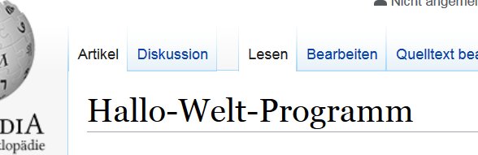

# Mein Projekt
In "Mein Projekt" lässt sich Text sowohl *kursiv* als auch **fett** als auch ~~durchgestrichen~~ darstellen. 
    
In diesem neuen Absatz sehen Sie ein Beispiel für Code: Tippen Sie `echo Hallo`.
Ein ganzer Code-Block:

```
echo Hallo
echo World
```
Hintergrund: Ein berühmter Skripter sagte mal
> Hallo Welt

Nachzulesen in der [Wikipedia](https://de.wikipedia.org/wiki/Hallo-Welt-Programm). Von der es hier einen Screenshot gibt:



## Installation

1. Installieren Sie das Programm
   1. Unter Linux:
      1. Ubuntu:
      1. Debian:
   1. Unter Windows
1. Nutzen Sie das Programm
   1. Unter Linux:
   1. ...

## Nutzung

Programmaufruf | Funktion
-------------- | --------
foobar -v | Erweiterte Informationen
foobar -t | Programm nur testen
foobar -vt | Programm mit allen Optionen ausführen

# ToDo:

- [x] Readme anlegen
- [x] Erste Formatierungen lernen
- [ ] Readme vervollständigen
- [ ] Readme veröffentlichen

### Beispiele

:smile:

## Fehlerbehebung
## Lizenz

