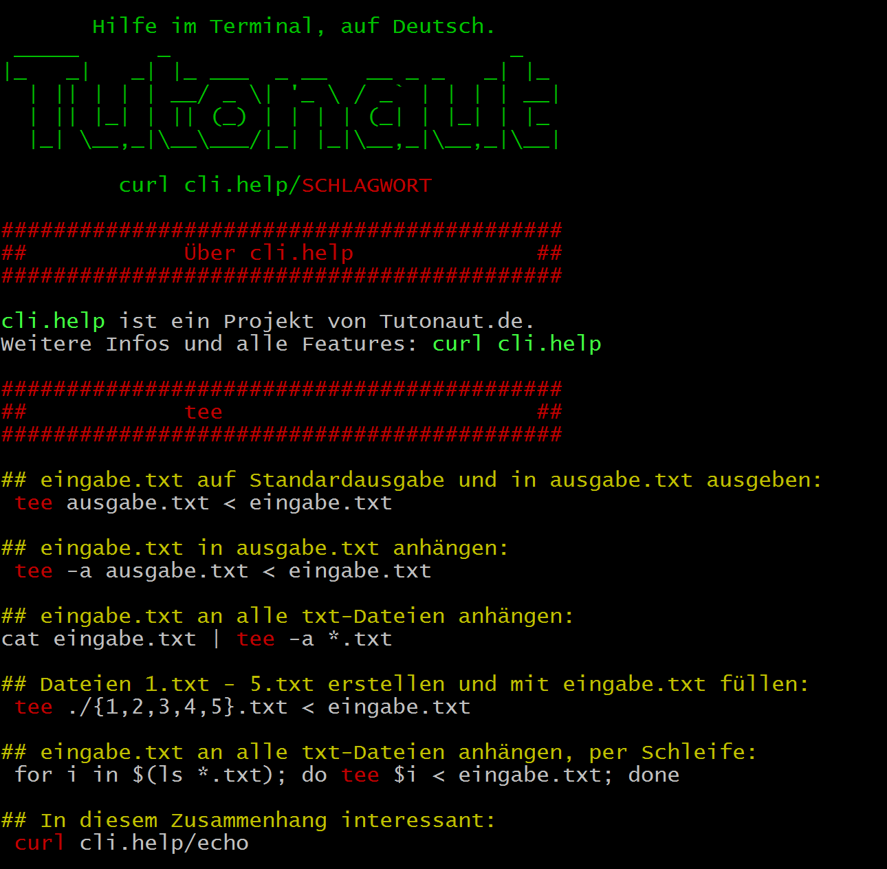

# cli.help - Beta!
### [Ein Projekt](https://www.tutonaut.de/neues-projekt-cli-help-praktische-hilfe-im-terminal-auf-deutsch) von [Tutonaut.de](https://www.tutonaut.de)
cli.help liefert Hilfe zu Command-Line-Interface-Werkzeugen, sprich Tools im Termnial. **Auf Deutsch, direkt im Terminal und ohne Client.** Inhaltlich gibt es nicht bloß die abstrakten Beschreibungen der Tool-eigenen Hilfen, sondern **echte Aufrufe** mit konkreten Dateinamen, Pfaden und Kombinationen von Optionen. Wo es sich anbietet gibt es zudem **typische Pipes** oder Hinweise zur Verwendung in **Schleifen und Abfragen.**

cli.help liefert zudem aber auch **Übersichten:** Typische Aufgaben der Nutzerverwaltung, Tools für Systeminformationen, die wichtigsten Vorgehensweisen bei der Textverarbeitung, Seiten über Networking, Systemupdates, Paketmanagement, nützliche Alias und so weiter. 

Und drittens könnt Ihr auch **Eure eigenen Cheatsheets,** aka Spickzettel einreichen.

Und hier mal eine fertige Hilfeseite für das Programm **tee:**

## Nutzung
Ihr könnt cli.help überall nutzen, wo das Standardprogramm **curl** läuft. Der Aufruf ist immer gleich:

    curl cli.help/chmod
	curl cli.help/grep
	curl cli.help/nutzerverwaltung
	curl cli.help/rechte
	
Ihr könnt die Seiten auch herunterladen und offline mit **cat** nutzen:

    wget $(curl cli.help/liste | tail -n +24 | head -n -5 | nl -s"cli.help/" | cut -c7-)
 
 wget bekommt einfach die Liste aller Tools, dank nl als URLs - der Rest (tail, head, cut) schneidet nur Ballast aus.
	
## Status und Inhalt
cli.help ist aktuell noch **im Aufbau** und entsprechend gibt es noch nicht alle Hilfeseiten. Ihr bekommt eine Liste aller fertigen Seiten über wahlweise:

    curl cli.help/befehle
	curl cli.help/programme
	curl cli.help/tools
	
Oder Ihr schaut oben in den Repo-Ordnern. Hier eine Übersicht der geplanten Inhalte:

Inhalte | Aufrufe | Status
------- | ------- | ------
cli.help-Startseite mit Projektinfos | start, index, main, hilfe, help | Fertig
Seite mit allen Seiten als Liste | liste, befehle, kommandos, tools, programme, list | Aktuell
Seite mit ALLEN Hilfen zum Durchsuchen | alles, komplett, dump | Aktuell
Thematische Übersichten | **nutzer,** rechte, aliasse, dateien, ordner, text, textverarbeitung, suche, prozesse, netzwerk, installieren, paketmanagement, pakete, update, regex | TBD (fett=fertig)
Sammlung von Aliassen | aliasse | TBD
Typische Linux-Tools | awk, sed, curl, **docker, git** ... | TBD (fett=fertig)
GNU Core Utilities (insgesamt 84 Tools) | ls, echo, groups, user, nice, chroot und so weiter | Fertig
Persönliche Cheat Sheets | cheatsheet_INITIALEN, cheatsheet_ml und so weiter | Dauerbaustelle
Hilfe für Dein Tool | dein_tool, sein_tool, ihr_tool | Melden!

Die Seiten mit **ALLEN Inhalten** sind dazu gedacht, sie einfach per grep zu durchsuchen:

    curl cli.help/dump | grep "while"
    curl cli.help/suche | grep chmod
	
Inhaltlich sind die Seiten "dump" und "suche" und "alles" und so weiter natürlich völlig identisch. Sinn dahinter: Wer kann sich schon alles merken ... So könnt Ihr einfach *fast* irgendwas eingeben. 

## Nutzer-Spickzettel
Ihr könnt gerne Eure eigene Hilfe, einen Spickzettel oder ähnliche Dinge erstellen und dann über das Muster **cheatsheet_INITIALEN** abrufen - **Markus Müller** also über

    curl cli.help/cheatsheet_mm
   
Passt dazu einfach die Vorlage-Datei (cheatsheet_vorlage) an und reicht sie ein: Via Mail, als Pull Request [(und zwar so)](https://www.tutonaut.de/aenderungen-in-github-projekten-einreichen/) oder wie auch immer. Die Inhalte sind natürlich **öffentlich.** Ich prüfe, ob die Formatierung passt, ansonsten könnt Ihr da rein schreiben was Ihr wollt.

Der Kopfbereich aus der Vorlage bleibt wie er ist, also Titel und über-cli.help-Bereich. Den Rest könnt Ihr gerne anders gestalten. Wie genau das geht, habe ich in einen [ausführlicheren Artikel](https://www.tutonaut.de/anleitung-terminal-ausgabe-mit-farben-und-ascii-art-aufhuebschen/) gepackt.

## Mitmachen!
Mitmachen ist hier wirklich mal einfach: Erstellt eigene Hilfeseiten mit der Vorlage, verbessert, korrigiert oder ergänzt vorhandene Seiten - oder empfehlt cli.help weiter, das hilft auf Dauer am meisten. **Oder stellt Fragen!** Wer weiß schon, was Ihr alles mit den CLI-Werkzeugen anstellt ...

Und wenn Ihr helfen wollt, aber nicht wisst, wie Github funktioniert, was ein Pull Request ist oder wie genau die Syntax der Vorlage tickt - fragt einfach. Es gibt hier auch kein unfreundliches "Lies erstmal das Handbuch, Du ..." :wink:

## Lizenz
Sämtliche Inhalte hier im Repo stehen unter Creative-Commons-Lizenz [CC-BY-SA.](https://creativecommons.org/licenses/by-sa/4.0/) Das heißt: Ihr könnt sie nach belieben verwenden, verändern und unter gleichen Bedingungen und Nennung des Original-Autors weitergeben. Eigene Änderungen müssen zudem kenntlich gemacht beziehungsweise erwähnt werden.

In der Praxis heißt das: Ihr könnt beispielsweise dieses Repository klonen, in meinegeilenhilfeseiten.de 2.0 umbenennen, Inhalte ändern und hinzufügen und Nutzern zur Verfügung stellen - auch in kommerziellen Umgebungen. In diesem Fall müsstet Ihr cli.help als Ursprungsprojekt nennen/verlinken und ebenso alles unter die CC-BY-SA-Lizenz stellen. Und Eure eigenen Änderungen könntet Ihr zum Beispiel in der Readme-Datei notieren. 

Und wenn jemand aus irgendwelchen Gründen Inhalte in ein Projekt mit inkompatibler Lizenz übernehmen will: Einfach kurz melden - ich bin zwar durchaus Copyleft-Fan, aber die Vorteile permissiver Lizenzen sehe ich durchaus :neckbeard:

## Urheber/Kontakt
cli.help ist ein Projekt von [Tutonaut.de/Mirco Lang](https://www.tutonaut.de/impressum) - zu erreichen über Pull Requests, [maschinist@tutonaut.de](mailto:maschinist@tutonaut.de) oder die Website.

    echo Mötr qre Snsg zvg Ehpu frva. | tr n-za-m a-z
